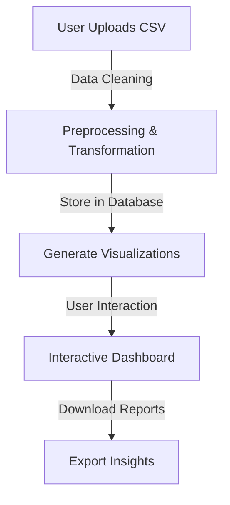

# HX2537: Data Visualization Dashboard

## 🎯 Problem Statement

**Data Visualization Dashboard - Data Science**

Create a dashboard to visualize datasets (e.g., COVID stats) with interactive charts.

---

## 📜 Table of Contents

1. [Introduction](#introduction)
2. [Directory Structure](#directory-structure)
3. [Dataset Overview](#dataset-overview)
4. [Key Features](#key-features)
5. [Step-by-Step Workflow](#step-by-step-workflow)
6. [Tech Stack](#tech-stack)
7. [Setup & Installation](#setup--installation)
8. [Usage](#usage)
9. [Demo](#demo)
10. [Future Improvements](#future-improvements)
11. [Team & Contributions](#team--contributions)
12. [License](#license)

---

## 📖 Introduction

### Understanding the Challenge
- Large datasets contain valuable insights but are difficult to process manually.
- Errors in data handling can lead to misleading conclusions.
- A structured, automated approach ensures accuracy and efficiency.

### Handling Large Datasets

| Issue                  | Solution                        |
|------------------------|--------------------------------|
| Manual analysis is slow | Automates data processing      |
| Error-prone data       | Ensures data consistency       |
| Large-scale datasets   | Efficient visualization tools  |
| Disease trend tracking | Interactive visual analytics  |
---

## 📂 Directory Structure

```
HX2537-Dashboard/
│── frontend/          # React.js frontend application
│   ├── components/    # Reusable UI components
│   ├── pages/         # Different views/pages
│   ├── assets/        # Images, icons, styles
│── backend/           # Flask/Node.js API
│   ├── data/          # Uploaded CSV/JSON files
│   ├── processing/    # Data cleaning & transformation scripts
│── docs/              # Documentation & guides
│── tests/             # Automated tests
│── README.md          # Project documentation
```

---

## 📂 Dataset Overview

| Data Type                         | Example               |
| --------------------------------- | --------------------- |
| COVID-19 cases per region         | `cases_by_region.csv` |
| Disease trends                    | `flu_outbreaks.csv`   |
| Hospitalization & mortality rates | `hospital_data.csv`   |

---

## 🎯 Key Features

- 📊 **Interactive Charts & Graphs** – Filter, zoom, and explore datasets with ease.
- 📂 **CSV File Upload** – Users can upload datasets related to diseases or other topics.
- 🔍 **Automated Data Cleaning** – Ensures structured and accurate analysis.
- 📡 **API Integration** – Fetch and process data from external sources.
- 🎨 **Customizable Visualizations** – Choose between bar charts, line graphs, pie charts, and more.
- 🌎 **Global & Local Data Filtering** – View insights by country, region, or category.
- 📱 **Responsive Design** – Works across desktops, tablets, and mobile devices.

---

## 🚀 Step-by-Step Workflow



---

## 🛠️ Tech Stack

| Component      | Technology                               |
| -------------- | ---------------------------------------- |
| **Frontend**   | React.js, D3.js / Chart.js, Tailwind CSS |
| **Backend**    | Node.js, Express.js, Python (Flask)      |
| **Database**   | Supabase                     |
| **Deployment** | Vercel / Heroku / AWS                    |

---

## 🚀 Setup & Installation

### Prerequisites

- Node.js (v16+)
- Python (if using Flask API)
- npm / yarn

### Installation Steps

```bash
git clone https://github.com/your-repo/hx2537-dashboard.git
cd hx2537-dashboard
npm install
npm start
```

---

## 🖥️ Usage

1. Upload a dataset (CSV/JSON) related to diseases or other domains.
2. The system will clean and preprocess the data automatically.
3. Select a visualization type (e.g., bar chart, line graph).
4. Apply filters and interact with the dashboard.
5. Download reports or share visualizations.

---

## 🎥 Demo

[Watch Demo](https://your-demo-link.com) | [Live Preview](https://your-live-dashboard.com)

---


## 🚀 Future Improvements

- 🔗 **More Data Sources** – Expand API integrations.
- 📌 **User Authentication** – Save custom dashboards.
- 🤖 **AI-powered Insights** – Provide trend predictions.
- 🏆 **Gamification** – Achievements for frequent users.

---


## **Meet The Team:**
1. **Aryan Paratakke**:

   - **GitHub**: [Aryan Paratakke GitHub](https://github.com/Aryan152005/)
   - **LinkedIn**: [Aryan Paratakke LinkedIn](https://in.linkedin.com/in/aryan-paratakke-43b879276)

2. **Arya Hotey**:

   - **GitHub**: [Arya Hotey GitHub](https://github.com/Arya202004)
   - **LinkedIn**: [Arya Hotey LinkedIn](https://in.linkedin.com/in/arya-hotey-aab5b32a7)

3. **Nishtha Kashyap**:

   - **GitHub**: [Nishtha Kashyap GitHub](https://github.com/nishtha932005)
   - **LinkedIn**: [Nishtha Kashyap LinkedIn](https://in.linkedin.com/in/nishtha-kashyap-0b6846293)

4. **Sushmit Partakke**:

   - **GitHub**: [Aryan Paratakke GitHub](https://github.com/Aryan152005/)
   - **LinkedIn**: [Aryan Paratakke LinkedIn](https://in.linkedin.com/in/aryan-paratakke-43b879276)