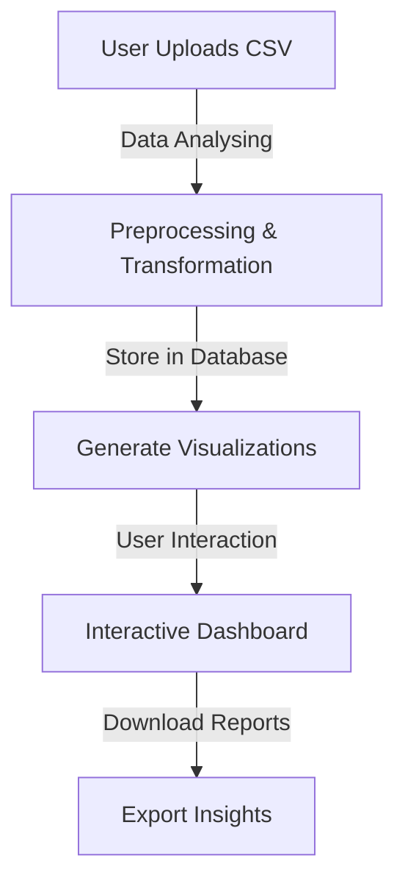

# HX2537: Data Visualization Dashboard

## 🎯 Problem Statement

### **Overview**

In today’s digital era, data is generated at an unprecedented rate. Extracting meaningful insights from large datasets requires effective visualization techniques. Our project, **HX2537: Data Visualization Dashboard**, aims to simplify complex datasets and enhance decision-making through interactive and dynamic visualizations.

### **Background**

Large datasets, especially in fields like healthcare, finance, and research, contain valuable insights but can be challenging to interpret. Traditional analysis methods often lead to:

- **Slow and error-prone data processing**
- **Difficulties in identifying trends and patterns**
- **Limited accessibility for non-technical users**

By providing an intuitive, interactive dashboard, we address these challenges and make data analysis more accessible and actionable.

### **Objective**

Our goal is to develop a user-friendly dashboard that enables:

- **Real-time data visualization**
- **Interactive exploration of trends and patterns**
- **Dataset analysis (null values, unique values, visualization suggestions)**
- **Seamless dataset integration from multiple sources**
- **User authentication and authorization via Supabase**

### **Impact**

- **Empower decision-makers** with accurate, real-time insights
- **Enhance accessibility** of complex datasets
- **Reduce manual data processing time** and improve efficiency

#### **Comparison: Traditional vs. Interactive Data Visualization**

| Factor               | Traditional Methods       | Interactive Dashboard |
| -------------------- | ------------------------- | --------------------- |
| Data Processing Time | Slow and manual           | Fast and automated    |
| User Interaction     | Limited                   | Highly interactive    |
| Trend Identification | Complex and static        | Dynamic and visual    |
| Accessibility        | Requires technical skills | Easy for all users    |

---

## 🌜 Table of Contents

1. [Introduction](#introduction)
2. [Demo](#demo)
3. [Directory Structure](#directory-structure)
4. [Key Features](#key-features)
5. [Step-by-Step Workflow](#step-by-step-workflow)
6. [Tech Stack](#tech-stack)
7. [Setup & Installation](#setup--installation)
8. [Usage](#usage)
9. [Future Improvements](#future-improvements)
10. [Meet The Team](#meet-the-team)
11. [Open Source Contributions](#open-source-contributions)
12. [License](#license)

---

## 🎥 Demo

[Watch Demo](https://your-demo-link.com) | [Live Preview](https://your-live-dashboard.com)

---

## 📂 Directory Structure

```
HX2537-Dashboard/
│── frontend/          # React.js + Vite frontend application
│   ├── components/    # Reusable UI components
│   ├── pages/         # Different views/pages
│   ├── assets/        # Images, icons, styles
│   ├── styles/        # Tailwind CSS styling files
│── backend/           # Supabase Backend
│   ├── database/      # PostgreSQL data storage
│   ├── auth/          # Supabase Authentication & Authorization
│── docs/              # Documentation & guides
│── tests/             # Automated tests
│── README.md          # Project documentation
```

---

## 🎯 Key Features

- 📊 **Interactive Charts & Graphs** – Filter, zoom, and explore datasets with ease.
- 📂 **CSV & JSON File Upload** – Users can upload datasets related to various domains.
- 🔍 **Dataset Analysis & Visualization Suggestions** – Provides insights on null values, unique values, and recommends ideal visualizations.
- 💼 **Supabase Backend Integration** – Efficient storage and retrieval of data.
- 🔑 **Supabase Authentication & Authorization** – Secure user management.
- 🎨 **Customizable Visualizations** – Choose between bar charts, line graphs, pie charts, and more.
- 🌎 **Global & Local Data Filtering** – View insights by country, region, or category.
- 📱 **Responsive Design** – Works across desktops, tablets, and mobile devices.
- 📈 **User-Interactive Data Exploration** – Enables dynamic adjustments and custom queries.
- 💾 **Data Export Options** – Download reports in CSV, PDF, or image formats.

---

## 🚀 Step-by-Step Workflow



---

## 📊 Additional Visuals

### **Example of Dataset Analysis**

| Column Name | Null Values (%) | Unique Values   | Suggested Visualization |
| ----------- | --------------- | --------------- | ----------------------- |
| Age         | 0%              | 50              | Histogram               |
| Salary      | 5%              | 1000            | Box Plot                |
| Gender      | 0%              | 2 (Male/Female) | Pie Chart               |

### **Sample Visualization Output**


---

## 🛠️ Tech Stack

| Component          | Technology                                      |
| ------------------ | ----------------------------------------------- |
| **Frontend**       | React.js (Vite), D3.js / Chart.js, Tailwind CSS |
| **Backend**        | Supabase (PostgreSQL, Auth, Storage)            |
| **Deployment**     | Vercel                                          |
| **Authentication** | Supabase Auth                                   |

---

## **Meet The Team**

1. **Aryan Paratakke**:
   - **GitHub**: [Aryan Paratakke GitHub](https://github.com/Aryan152005/)
   - **LinkedIn**: [Aryan Paratakke LinkedIn](https://in.linkedin.com/in/aryan-paratakke-43b879276)

2. **Arya Hotey**:
   - **GitHub**: [Arya Hotey GitHub](https://github.com/Arya202004)
   - **LinkedIn**: [Arya Hotey LinkedIn](https://in.linkedin.com/in/arya-hotey-aab5b32a7)

3. **Nishtha Kashyap**:
   - **GitHub**: [Nishtha Kashyap GitHub](https://github.com/nishtha932005)
   - **LinkedIn**: [Nishtha Kashyap LinkedIn](https://in.linkedin.com/in/nishtha-kashyap-0b6846293)

4. **Sushmit Partakke**:
   - **GitHub**: [Thesushmit GitHub](https://github.com/Thesushmit/)
   - **LinkedIn**: [Sushmit Partakke LinkedIn](https://www.linkedin.com/in/sushmit-partakke-04bb6b2a9/)

---

## 📖 Open Source Contributions

We welcome contributions! Feel free to fork the repository, submit issues, and make pull requests.

---

## 📝 License

This project is licensed under the MIT License. See the LICENSE file for details.

