# HX2537: Data Visualization Dashboard

## 🎯 Problem Statement

Create a dashboard to visualize datasets (e.g., COVID stats) with interactive charts.

### **Overview**

In today’s digital era, data is generated at an unprecedented rate. Extracting meaningful insights from large datasets requires effective visualization techniques. Our project, **Data Drishti**, aims to simplify complex datasets and enhance decision-making through interactive and dynamic visualizations.

### **Background**

Large datasets, especially in fields like healthcare, finance, and research, contain valuable insights but can be challenging to interpret. Traditional analysis methods often lead to:

- **Slow and error-prone data processing**
- **Difficulties in identifying trends and patterns**
- **Limited accessibility for non-technical users**

By providing an intuitive, interactive dashboard, we address these challenges and make data analysis more accessible and actionable.

### **Objective**

Our goal is to develop a user-friendly dashboard that enables:

- **Real-time data visualization**
- **Interactive exploration of trends and patterns**
- **Dataset analysis (null values, unique values, visualization suggestions)**
- **Seamless dataset integration from multiple sources**
- **User authentication and authorization via Supabase**

### **Impact**

- **Empower decision-makers** with accurate, real-time insights
- **Enhance accessibility** of complex datasets
- **Reduce manual data processing time** and improve efficiency

#### **Comparison: Traditional vs. Interactive Data Visualization**

| Factor               | Traditional Methods       | Interactive Dashboard |
| -------------------- | ------------------------- | --------------------- |
| Data Processing Time | Slow and manual           | Fast and automated    |
| User Interaction     | Limited                   | Highly interactive    |
| Trend Identification | Complex and static        | Dynamic and visual    |
| Accessibility        | Requires technical skills | Easy for all users    |

---

## 🌜 Table of Contents

1. [Introduction](#introduction)
2. [Demo](#demo)
3. [Directory Structure](#directory-structure)
4. [Key Features](#key-features)
5. [Step-by-Step Workflow](#step-by-step-workflow)
6. [Tech Stack](#tech-stack)
7. [Future Enhancements](#future-enhancements)
8. [Meet The Team](#meet-the-team)
9. [Open Source Contributions](#open-source-contributions)
10. [License](#license)

---

## 🎥 Demo

 | 
[Live Website](https://datadrishti-two.vercel.app/)

---

## 📂 Directory Structure

```        
│── src/          
│   ├── components/    
│   ├── contexts/
│   ├── hooks/
│   ├── integrations/
│   ├── lib/
│   ├── pages/         
│   ├── App.tsx       
│   ├── App.css
│   ├── index.css
│   ├── main.tsx       
│   ├── vite-env.d.ts  
│── supabase/           
│   ├── config.toml    
│── .gitignore           
│── bun.lockb           
│── components.json      
│── covid-cases.csv      
│── covid-vaccines.csv   
│── download_data.ipynb  
│── eslint.config.js     
│── index.html          
│── package-lock.json   
│── package.json        
│── postcss.config.js
│── Projeto_COVID_19_Dash/
│── README.md
│── tailwind.config.ts
│── tsconfig.app.json
│── tsconfig.json
│── tsconfig.node.json
│── video.gif
│── vite.config.ts
```

---

## 🎯 Key Features

- 📊 **Interactive Charts & Graphs** – Filter, zoom, and explore datasets with ease.
- 📂 **CSV & JSON File Upload** – Users can upload datasets related to various domains.
- 🔍 **Dataset Analysis & Visualization Suggestions** – Provides insights on null values, unique values, and recommends ideal visualizations.
- 💼 **Supabase Backend Integration** – Efficient storage and retrieval of data.
- 🔑 **Supabase Authentication & Authorization** – Secure user management.
- 🎨 **Customizable Visualizations** – Choose between bar charts, line graphs, pie charts, and more.
- 🌎 **Global & Local Data Filtering** – View insights by country, region, or category.
- 📱 **Responsive Design** – Works across desktops, tablets, and mobile devices.
- 📈 **User-Interactive Data Exploration** – Enables dynamic adjustments and custom queries.
- 💾 **Data Export Options** – Download reports in CSV, PDF, or image formats.

---

## 🚀 Step-by-Step Workflow

```mermaid

graph TD;
    A[User Uploads CSV] -->|Data Analysing| B[Preprocessing & Transformation];
    B -->|Store in Database| C[Generate Visualizations];
    C -->|User Interaction| D[Interactive Dashboard];
    D -->|Download Reports| E[Export Insights];

```




---

## 🛠️ Tech Stack

| Component          | Technology                                      |
| ------------------ | ----------------------------------------------- |
| **Frontend**       | React.js (Vite), D3.js / Chart.js, Tailwind CSS |
| **Backend**        | Supabase (PostgreSQL, Auth, Storage)            |
| **Deployment**     | Vercel                                          |
| **Authentication** | Supabase Auth                                   |

---

## 🚀 Future Enhancements

1. **AI-Powered Insights** – Detect trends, anomalies & predictions.  
2. **Advanced Filtering & Querying** – SQL-based queries & multi-dimensional filters.  
3. **Automatic Data Preprocessing** – Handle missing values, outliers & data transformation.  
4. **More Data Source Integrations** – APIs, Google Sheets & real-time data streaming.  
5. **Collaboration & Sharing** – Multi-user roles, shareable dashboards.  
6. **Customizable Reports** – Save layouts, export interactive PDFs.  
7. **Mobile App Version** – React Native app for iOS & Android.  
8. **Voice & Chatbot Support** – NLP chatbot & voice commands.    
9. **Real-Time Collaboration** – Live editing, alerts for data changes.  

---
## **Meet The Team**

1. **Aryan Paratakke**:
   - **GitHub**: [Aryan Paratakke GitHub](https://github.com/Aryan152005/)
   - **LinkedIn**: [Aryan Paratakke LinkedIn](https://in.linkedin.com/in/aryan-paratakke-43b879276)

2. **Arya Hotey**:
   - **GitHub**: [Arya Hotey GitHub](https://github.com/Arya202004)
   - **LinkedIn**: [Arya Hotey LinkedIn](https://in.linkedin.com/in/arya-hotey-aab5b32a7)

3. **Nishtha Kashyap**:
   - **GitHub**: [Nishtha Kashyap GitHub](https://github.com/nishtha932005)
   - **LinkedIn**: [Nishtha Kashyap LinkedIn](https://in.linkedin.com/in/nishtha-kashyap-0b6846293)

4. **Sushmit Partakke**:
   - **GitHub**: [Thesushmit GitHub](https://github.com/Thesushmit/)
   - **LinkedIn**: [Sushmit Partakke LinkedIn](https://www.linkedin.com/in/sushmit-partakke-04bb6b2a9/)

---

## 📖 Open Source Contributions

We welcome contributions! Feel free to fork the repository, submit issues, and make pull requests.

---

## 📝 License

This project is licensed under the MIT License. See the LICENSE file for details.

